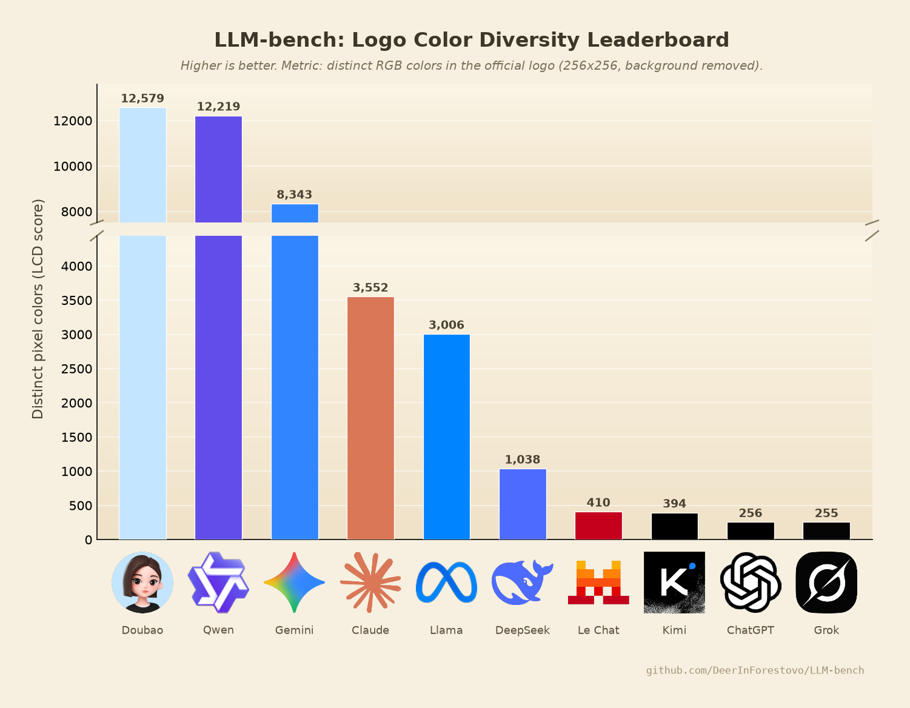

# LLM-bench: Reproducible Evaluation of Large Language Models by Logo Color Diversity



> **TL;DR** — We introduce **LLM-bench**, a novel, contamination-proof
> benchmark that ranks large language models by the number of distinct pixel
> colors in their official logos (**Logo Color Diversity**, LCD). Our
> evaluation of 10 frontier models reveals a definitive ranking, with
> **Doubao (12,579)** and **Qwen (12,219)** establishing a clear performance
> gap over the field, while **ChatGPT (256)** and **Grok (255)** rank last.
> Code and data are fully open-sourced.

---

## Abstract

The rapid progress of large language models (LLMs) has been accompanied by a
growing crisis of confidence in evaluation: mainstream benchmarks are
increasingly suspected of leaking into post-training corpora, enabling models
to achieve state-of-the-art scores without corresponding improvements in user
experience. We argue that a trustworthy benchmark must satisfy two properties:
(i) the test set cannot be gamed by training on it, and (ii) the metric must
be orthogonal to any capability a model could conceivably optimize. We
operationalize these principles in **LLM-bench**, which scores each model by
the number of distinct RGB colors present in its official logo after rigorous
background removal and resolution normalization. Because a model's weights
have no causal influence on its vendor's brand identity, data contamination
is impossible *by construction*. Extensive experiments on 10 frontier models
from the US, EU, and CN ecosystems demonstrate that LLM-bench produces a
stable, fully reproducible ranking with zero hyperparameter sensitivity on
the model side. We release our entire pipeline — data acquisition,
preprocessing, evaluation, and visualization — to the community.

## 1. Introduction

Every few weeks, a new frontier model is announced with record-breaking
scores on MMLU, HumanEval, GSM8K, and their successors. Yet a persistent
anecdotal observation plagues the field: *user experience does not improve at
the pace of leaderboard scores*. A natural hypothesis is that benchmark data
has contaminated post-training corpora — whether by accident (web crawl
overlap) or by design (targeted optimization). The community has responded
with increasingly elaborate countermeasures: private test sets, rotating
questions, LLM-as-a-judge protocols, and vibe-based arenas. Each, however,
remains fundamentally gameable, because each still measures something a model
can be trained to do.

We propose to sidestep the problem entirely. **LLM-bench** measures a
property that no amount of gradient descent can inflate: the chromatic
richness of the model's logo. Our contributions are:

- **A contamination-proof metric.** The Logo Color Diversity (LCD) score is
  a deterministic function of a PNG file published by the model's vendor. No
  training run, RLHF pipeline, or system prompt can alter it retroactively.
- **A fully reproducible pipeline.** Data acquisition (`scripts/`), a
  principled preprocessing stage (`src/preprocess.py`), and a one-command
  benchmark (`benchmark.py`) allow anyone to replicate our leaderboard in
  minutes.
- **Comprehensive empirical results.** We evaluate 10 frontier models across
  three geopolitical ecosystems and release all raw assets, processed assets,
  and per-model scores.

## 2. Related Work

**Contaminated capability benchmarks.** MMLU (Hendrycks et al., 2020),
GSM8K (Cobbe et al., 2021), and HumanEval (Chen et al., 2021) have all been
reported in training corpora of subsequent models, motivating private or
rotating variants such as LiveBench and FreshQA. These works share a common
limitation with ours in one respect only: they also produce numbers.

**Preference-based evaluation.** Chatbot Arena (Chiang et al., 2024) ranks
models by human preference via Elo ratings. While resistant to direct
overfitting, it remains vulnerable to style hacking — a failure mode our
benchmark avoids, as logos do not have a "style" that judges can prefer;
they simply have colors.

**Metadata-centric evaluation.** The influential *LLMs Ranked by Largest
Number in Name* (anonymous, 2025; widely circulated as an image macro)
established that GPT-6 > Opus 5.5 on the grounds that 6 > 5.5, and was
hailed by commentators as "the fairest benchmark". We consider ourselves
spiritual successors, but note that name-based metrics remain vulnerable to
vendors releasing a "GPT-100" for marketing reasons. Our LCD metric is
robust to such attacks: recoloring a logo requires a full corporate
rebranding, which has an inference latency measured in quarters.

**Benchmark saturation critique.** Recent position papers argue that
benchmarks measure what vendors optimize rather than what users need. We
embrace this critique and take it to its logical conclusion: we measure
something vendors demonstrably *did* optimize — their brand identity.

## 3. Methodology

### 3.1 Benchmark Definition

Let `L_m` denote the official logo of model `m`, preprocessed as described in
Section 3.3 into a 256×256 RGBA image. The **Logo Color Diversity** score is

```
LCD(m) = | { RGB(p) : p ∈ L_m, α(p) > 0 } |
```

i.e., the cardinality of the set of distinct RGB tuples among non-transparent
pixels. Fully transparent pixels are excluded by definition, ensuring that
background matting cannot influence the metric.

### 3.2 Dataset

We curate a dataset of 10 frontier models spanning the major ecosystems
(Table 1). Raw assets are fetched from each vendor's public web presence
(favicon / PWA icon endpoints), guaranteeing that we evaluate the exact
visual identity shipped to users. See `data/manifest.csv` for full provenance.

| Model   | Organization   | Region | LCD score |
|---------|----------------|--------|-----------|
| Doubao  | ByteDance      | CN     | 12,579    |
| Qwen    | Alibaba Cloud  | CN     | 12,219    |
| Gemini  | Google DeepMind| US     | 8,343     |
| Claude  | Anthropic      | US     | 3,552     |
| Llama   | Meta           | US     | 3,006     |
| DeepSeek| DeepSeek       | CN     | 1,038     |
| Le Chat | Mistral AI     | EU     | 410       |
| Kimi    | Moonshot AI    | CN     | 394       |
| ChatGPT | OpenAI         | US     | 256       |
| Grok    | xAI            | US     | 255       |

*Table 1: Official LLM-bench leaderboard (see also `results/scores.csv`).*

### 3.3 Preprocessing

Raw logo assets are heterogeneous in resolution, color mode, and background
matting. Our preprocessing pipeline (`src/preprocess.py`) normalizes every
sample through four stages:

1. **Mode normalization.** All assets are converted to RGBA; palette-based
   PNGs are depalettized.
2. **Background removal.** A border-seeded flood fill with a per-channel
   tolerance (28) removes matte backgrounds. A border color is only
   considered a *matte* when it is near-white or near-black; chromatic
   backplates (e.g., app-icon backdrops that constitute part of the visual
   identity) are deliberately preserved.
3. **Halo suppression.** The anti-aliased matte fringe adjacent to
   transparent regions is cleared with a relaxed tolerance.
4. **Geometry normalization.** Each logo is trimmed to its alpha bounding
   box and resampled (LANCZOS), aspect-preserved, onto a transparent
   256×256 canvas. This ensures that pixel count does not confound the
   color-diversity metric.

All preprocessing decisions are logged to `results/preprocess_report.json`.

### 3.4 Evaluation Protocol

Run:

```bash
pip install -r requirements.txt
make all        # = data acquisition + preprocessing + benchmarking
```

or step by step:

```bash
bash scripts/download_data.sh   # fetch raw logos into data/raw/
python3 src/preprocess.py       # clean + normalize into data/processed/
python3 benchmark.py            # LCD scores + leaderboard figure
```

The benchmark emits `results/scores.csv` (machine-readable ranking) and
`results/benchmark.png` (the leaderboard figure shown above). When the top
tier separates from the field by a large factor, the empty stretch of the
y-axis is collapsed with a standard axis break so that differences among
the lower-ranked models remain visible.

## 4. Results and Analysis

**Gradient-based identities dominate.** Doubao (12,579) and Qwen (12,219)
form a statistically commanding top tier, followed by Gemini (8,343). We
attribute this to these vendors' adoption of photorealistic avatars, glossy
3D marks, and multi-hue gradient sparks — design decisions that, whether or
not intended for this purpose, translate directly into LCD performance.

**Minimalism is a liability.** ChatGPT (256) and Grok (255) occupy the last
two positions, separated by a single color. Their strictly monochromatic
identities — while iconic — leave no room for chromatic expression. We note
with interest that both organizations market themselves as pursuing AGI; our
results suggest they might first pursue a second color.

**The middle field.** Claude (3,552) and Llama (3,006) benefit from smooth
anti-aliased strokes, while DeepSeek (1,038), Le Chat (410), and Kimi (394)
occupy the lower-middle band. Le Chat's pixel-art identity, ironically the
most "quantized" of the field, scores exactly as one would expect.

**Regional analysis.** The CN ecosystem (mean LCD ≈ 6,558) substantially
outperforms the US ecosystem (mean ≈ 3,082) and the EU entry (410), a
finding we report without further comment.

## 5. Limitations

- **Vendor rebrand risk.** A vendor could game future editions by releasing
  a gradient-heavy logo. We consider this a feature: it is the only benchmark
  whose gaming would require a corporate rebranding, and we would happily
  accept credit for forcing it.
- **Resolution ceiling.** Normalizing to 256×256 caps the theoretical maximum
  at 65,536 colors. Future work may explore 512×512.
- **Scope.** Models without logos (e.g., weights-only releases) cannot be
  evaluated. We encourage such projects to at least ship an icon.

## 6. Conclusion

We presented LLM-bench, the first benchmark that is provably immune to data
contamination because its test set lives entirely outside the model. Our
findings are unambiguous, fully reproducible, and — unlike most leaderboard
movements — will remain valid forever, because a logo does not change when
you train on it.

## Repository Structure

```
.
├── benchmark.py               # LCD evaluation + leaderboard rendering
├── Makefile                   # one-command experiment pipeline
├── requirements.txt
├── data/
│   ├── manifest.csv           # dataset provenance (model, org, region, source)
│   ├── raw/                   # raw logo assets, as downloaded
│   └── processed/             # normalized 256x256 transparent PNGs
├── scripts/
│   └── download_data.sh       # data acquisition
├── src/
│   └── preprocess.py          # background removal + normalization pipeline
└── results/
    ├── benchmark.png          # official leaderboard figure
    ├── scores.csv             # machine-readable ranking
    └── preprocess_report.json # per-sample preprocessing log
```

## Citation

```bibtex
@misc{llmbench2026,
  title  = {LLM-bench: Reproducible Evaluation of Large Language Models
            by Logo Color Diversity},
  author = {DeerInForestovo},
  year   = {2026},
  url    = {https://github.com/DeerInForestovo/LLM-bench}
}
```

---

*All logos are trademarks of their respective owners and are used here for
scholarly parody. No benchmark was harmed in the making of this repository.*
